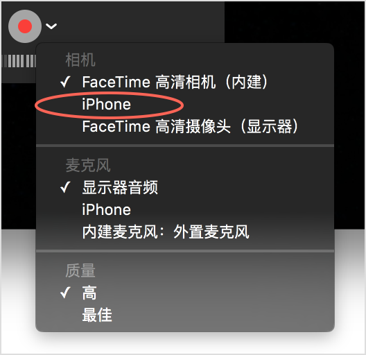

title: 通用开发杂项配置
---

## Xcode Command Line Tools

在Mac下面的很多软件安装都会涉及到`编译`，依赖于`Xcode Command Line Tools`这个工具，Mac下面的Xcode自带了这个工具，我们可以在`Terminal`输入`gcc`或者`make`,然后弹出一个选项会让你安装。
装了`Xcode`的同学就没有必要单独安装它了，因为`Xcode` 自带此工具。

## 终端里临时设置代理

有时候使用终端命令例如 brew 需要设置代理以便FQ。

举个例子，利用brew-cask安装macdown:

```
brew cask install macdown
```

因为macdown的安装源托管在amazonaws，不幸的是aws被Q，

这时候我们可以设置终端代理为蓝灯代理，让brew-cask的相关命令顺利FQ:

```

ALL_PROXY=http://127.0.0.1:8787 brew cask install macdown

```

Done!

## 设置默认的编辑器

很多应用调用默认编辑器时会使用`$EDITOR`这个环境变量，因此我们可以设置该变量为我们喜欢的编辑器。

例如设置默认编辑为atom：

```
export EDITOR=atom
```

或者，右单击某种扩展名的文件来改变其默认打开程序：

> "Get Info" -> "Open with:" -> (Select Atom) -> "Change All"

## 清dns缓存

```
sudo discoveryutil mdnsflushcache
sudo discoveryutil udnsflushcaches
```

## QuickTime
是的，你没有看错，**Apple** 官方提供的视频播放器可以实现iOS设备的屏幕串流/录制功能，你不需要购买高价的 **Lighting** 视频转接口，这对需要iOS屏幕分享，做Demo演示的你再合适不过。操作很简单：

1. 将iOS设备插入Mac的USB口
2. 打开 **QuickTime** 
3. 菜单栏新建影片录制 
4. 切换摄像头至你的iOS移动设备



太棒了！开箱即用