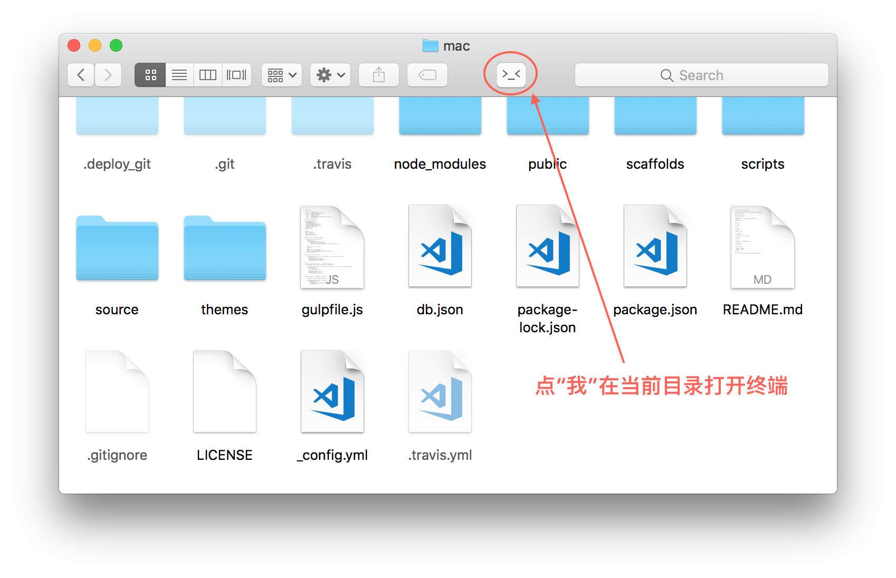

title: Shell以及终端软件
---

全栈开发在Mac下面会经常使用终端，在`OS X El Capitan‎`之前，恐怕系统默认的`Terminal+bash+screen`是无法跟`iTerms+zsh+tmux`进行匹敌。

普通Mac用户大可不必安装这三个软件，但是作为 **开发者** ，装上这三个软件会让你爱不释手。

## iTerm2

iTerm2是一款优秀的终端软件，可用来代替系统自带的Terminal。

### 安装iTerm2

  ```
  brew cask install iTerm2
  ```
### 主题设置

  推荐下载[Solarized dark iterm colors](https://github.com/altercation/solarized/tree/master/iterm2-colors-solarized)，在Preferences -> Profiles -> Default -> Colors -> Load Presets 将其导入，作为默认颜色。

  萝卜青菜各有所爱，也可以到[iTerm2-Color-Schemes](https://github.com/mbadolato/iTerm2-Color-Schemes) 下载安装上百种主题设置。

### 特点

1. 快捷键非常丰富（不一一详细列举，只列了几个目前常用的）

  - `⌘ + 数字`: 切换标签页，`⌘ + 方向键` 按方向切换标签页
  - `⌘ + enter`: 切换全屏
  - `⌘ + d`: 垂直分屏，`⌘ + shift + d`: 水平分屏。使用`⌘ + ]`和`⌘ + [`在最近使用的分屏直接切换.而`⌘ + opt + 方向键`切换到指定位置的分屏。
  - `⌘ + t` :新的标签页
  - `⌘ + r`:清屏

2. 兼容性好

  这一点在远程连接服务器的时候才可以体验到，默认的系统终端有时候会出现乱码问题。


## oh-my-zsh

什么是`oh-my-zsh` ？ 简单来说`oh-my-zsh` 是基于 `zsh` 的增强配置, 附带各种常用的插件。
[zsh](http://zsh.sourceforge.net/) 是一种Shell。
Mac是基于UNIX的一套系统，而Shell可以说是UNIX的一个外壳，在Mac里面我们可以在`Terminal`执行下面命令看看系统有几种shell：

```
cat /etc/shells
```

不出意外的话显示如下：

```
/bin/bash
/bin/csh
/bin/ksh
/bin/sh
/bin/tcsh
/bin/zsh
```

Mac默认使用的是`bash`这个shell，英文26个字母当中`z`排在最后，这足以说明`zsh`是有多强大的（当然了这是我瞎掰的），不过`zsh`说是`终极Shell`应该是一点都不过分的，列举几个优势让你看看有多强大 **下面优势摘自MacTalk**：

* 强大的历史纪录功能，输入 grep 然后用上下箭头可以翻阅你执行的所有 grep 命令
* 智能拼写纠正，输入gtep mactalk * -R，系统会提示：zsh: correct ‘gtep’ to ‘grep’ [nyae]? 比妹纸贴心吧，她们向来都是让你猜的……
* 各种补全：路径补全、命令补全，命令参数补全，插件内容补全等等。触发补全只需要按一下或两下 tab 键，补全项可以使用 ctrl+n/p/f/b上下左右切换。比如你想杀掉 java 的进程，只需要输入 kill java + tab键，如果只有一个 java 进程，zsh 会自动替换为进程的 pid，如果有多个则会出现选择项供你选择。ssh + 空格 + 两个tab键，zsh会列出所有访问过的主机和用户名进行补全
* 智能跳转，安装了autojump之后，zsh 会自动记录你访问过的目录，通过 j + 目录名 可以直接进行目录跳转，而且目录名支持模糊匹配和自动补全，例如你访问过hadoop-1.0.0目录，输入j hado 即可正确跳转。j –stat 可以看你的历史路径库
* 目录浏览和跳转：输入 d，即可列出你在这个会话里访问的目录列表，输入列表前的序号，即可直接跳转。

### 安装`oh-my-zsh`

1. 安装

  ```
  sh -c "$(curl -fsSL https://raw.github.com/robbyrussell/oh-my-zsh/master/tools/install.sh)"

  ```

2. 设置zsh为你的默认shell

  ```
  chsh -s /bin/zsh

  ```

3. 更多关于`oh-my-zsh`的使用请移步[这里](https://github.com/robbyrussell/oh-my-zsh)


### 更新zsh

安装完`oh-my-zsh`之后，我们其实还可以利用 `brew` 更新下系统默认安装的`zsh`。

```
# check the zsh info
brew info zsh

# install zsh
brew install --disable-etcdir zsh

# add shell path
sudo vim /etc/shells

# add the following line into the very end of the file(/etc/shells)
/usr/local/bin/zsh

# change default shell
chsh -s /usr/local/bin/zsh
```

## tmux - 优秀的终端复用软件

你是否`ssh`远程到服务器之后因为一不小心网络中断而得重新`ssh`上去？

你是否在你的编译还没结束的时候想要暂停下来，然后关掉电脑回家之后再继续编译但最后结果却是需要重新进行编译？

又或者你想过自己在终端开了一大堆的窗口但是关闭终端之后还想你的服务继续运行？

如果你上面的问题都没想过，那么你可以跳过这个软件了，等你哪一天有需要的时候再回来看看。

如果你跟我一样想过上面的其中某个问题，那么`tmux`强烈建议你安装。

* window，pane的概念可以很好地进行多窗口切换，窗口分割。
* 状态行配置很容易。
* vi 模式
* 复制粘贴缓冲区
* 脚本化.通过脚本可以自动化窗口布局。

### 安装tmux

  ```
  brew install tmux
  ```
### 使用tmux

Prefix-Command前置操作：所有下面介绍的快捷键，都必须以前置操作开始。tmux默认的前置操作是CTRL+b。例如，我们想要新建一个窗体，就需要先在键盘上摁下CTRL+b，松开后再摁下n键。

**Session相关操作**

| 操作 |  快捷键  |
| :---| :---- |
|  查看/切换session |  prefix s  |
|  离开Session |  prefix d  |
|  重命名当前Session |  prefix $ |


**Window相关操作**

| 操作 |  快捷键  |
| :---| :---- |
|  新建窗口 |  prefix c  |
|  切换到上一个活动的窗口 |  prefix space  |
|  关闭一个窗口 |  prefix & |
|  使用窗口号切换 |  prefix 窗口号 |


**Pane相关操作**

| 操作 |  快捷键  |
| :---| :---- |
|  切换到下一个窗格 |  prefix o  |
|  查看所有窗格的编号 |  prefix q  |
|  垂直拆分出一个新窗格 |  prefix “ |
|  水平拆分出一个新窗格 |  prefix % |
|  暂时把一个窗体放到最大 |  prefix z |


### 个性化定制tmux

  默认情况下的`tmux`风格比较简陋，推荐使用[gpakoz的tmux配置](https://github.com/gpakosz/.tmux)，实现了如下功能：

  - 基于powerline的美化
  - 显示笔记本电池电量
  - 和Mac互通的剪切板
  - 和vim更相近的快捷键

  安装方式如下：

  ```
   cd
   rm -rf .tmux
   git clone https://github.com/gpakosz/.tmux.git
   ln -s .tmux/.tmux.conf
   cp .tmux/.tmux.conf.local .
  ```

了解更多`tmux`可以点击[这里](http://foocoder.com/blog/zhong-duan-huan-jing-zhi-tmux.html/)

## A bonus! --- [Go2Shell](http://zipzapmac.com/Go2Shell)
**Go2Shell** 是一个便捷小工具，它可以实现一次点击，即可在当前目录中打开终端，这比打开终端->`cd`到当前目录直观快捷的多，就像下面这样:



## 其他常见问题

### Terminal crashes "pointer being freed was not allocated"

原因可能是你改了系统自带的一些路径的权限，例如`/usr/bin/`

解决办法是利用打开Disk Utility程序修复磁盘权限
