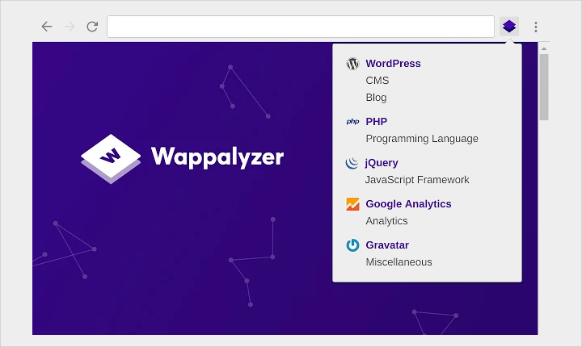
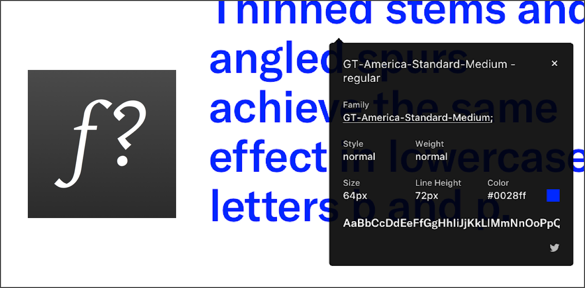
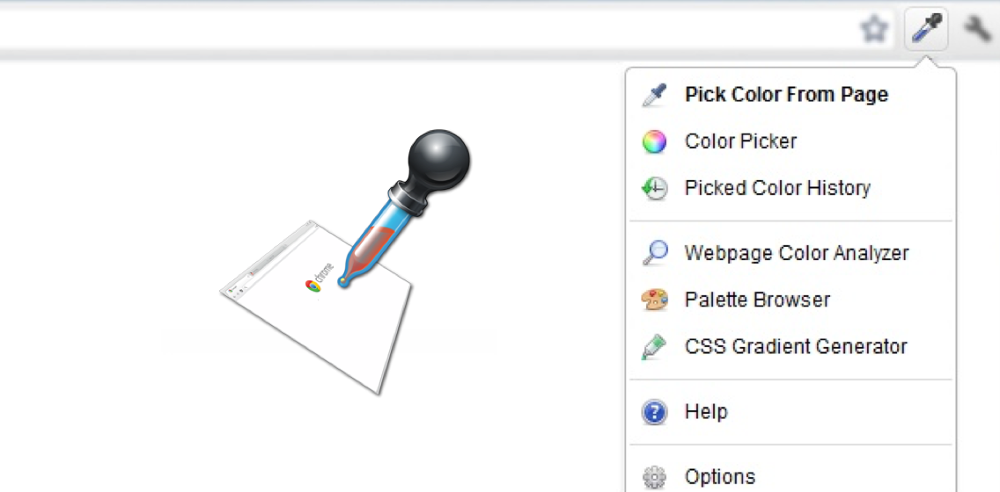

title: Chrome插件
---

作为前端的你不可避免的会使用 **Chrome** 调试程序，别忘了 **Google** 是一种信仰！

## 插件推荐

## [Wappalyzer](https://www.wappalyzer.com/)

这是一个分析当前浏览站点使用的技术框架的插件，想看看这么炫酷的站点背后用了什么技术吗，安装 **Wappalyzer** 给你答案！

## [EditThisCookie](http://www.editthiscookie.com/)

**EditThisCookie** 是一个cookie管理器。你可以添加，删除，编辑，搜索，锁定和屏蔽cookies！
太棒了！有了这个插件，在和后端联调时，一切都变得轻松起来;)

## [Whatfont](http://www.chengyinliu.com/whatfont.html)

优秀的网页离不开漂亮的字体，这个插件可以检测网页中使用的是什么字体，信息非常详尽，如果你是设计师，结合诸如 [**Google Fonts**](https://fonts.google.com/)这类开源字体网站，就可以从别人的优秀设计中汲取灵感并产出自己的作品。

## [ColorZilla](http://www.colorzilla.com/chrome/)

轻便快捷的页面取色工具。你不会想要每次都启动 **Photoshop** 或 **Sketch** 的取色器取色吧？试试这个，轻轻一点颜色便知，它还贴心地自动帮你把取到的色值放进了剪贴板，下一步你只需要 `command+v` 了！

