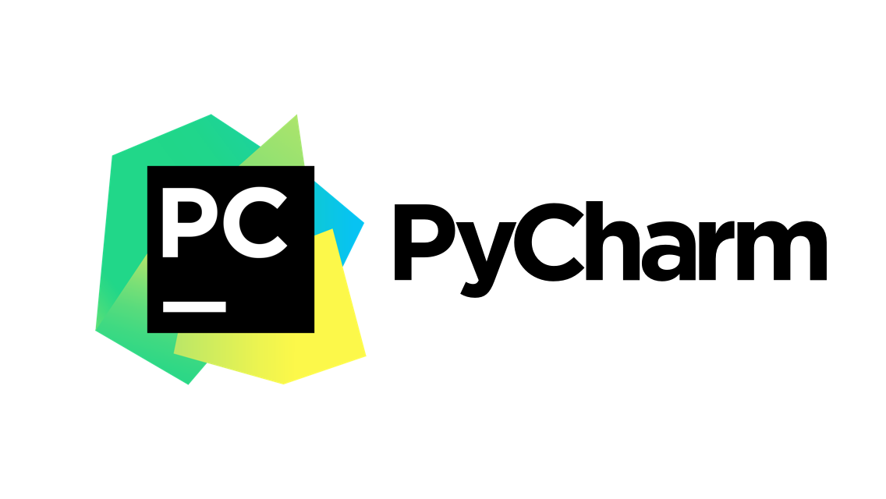

title: Python
---
当今最火的语言几乎胜任了所有领域，em...除了前端;）**Mac** 全栈怎么能少了 **Python**？

没错，你的 **Mac** 自带 **Python**，这简直是世界上最好的开发工具！

## [pip](https://pip.pypa.io/en/stable/installing/)

**pip** 是 **Python** 的包管理工具

要安装它，你只需要在终端键入：

```
sudo easy_install pip
```

你将会使用 `pip install` 安装依赖包，使用 `pip uninstall` 卸载依赖，所有可用的依赖包都会在[这个网站](https://pypi.org/)注册，去看看吧，想要的应有尽有。

你还可以通过 `pip freeze` 命令将当前安装的依赖列表“冻结”，像下面这样：

```
pip freeze > requirements.txt
```
如果项目中只需版本控制这个 `requirements.txt` 文件，其他协作者执行 `pip install -r requirements.txt` 便可复制你当前安装的依赖环境，是不是有点像 **Node** 的 **package.json**？

## [Virtualenv](https://virtualenv.pypa.io/en/stable/)

相信我，你不会想忽视这个工具，先执行 `pip install virtualenv` 安装它吧！

`virtualenv` 会给当前目录创立一个与系统环境 **隔离** 的 “虚拟” **Python** 环境，正如其名。

- 运行 `virtualenv venv` 在当前目录创建一个以 `venv` 命名的文件夹，这代表了你本地的虚拟环境

- 运行 `source venv/bin/activate` 来激活虚拟环境

如果命令行开头出现了 `(venv)` 字样，恭喜你，你成功进入了虚拟环境！现在你可以随意安装依赖而不影响系统环境了。

- 使用 `deactivate` 命令退出虚拟环境
 
想想 **Python 2.x** 和 **Python 3.x** 的兼容问题就头大，现在有了 `virtualenv`, 你可以在需要 **Python 3.x** 环境的项目中使用 **Python 3.x**，同时不会干扰系统默认的 **Python** 环境，也避免了影响其他项目，就是这么干净利落！

## [PyCharm](https://www.jetbrains.com/pycharm/)



**PyCharm** 是大名鼎鼎的 **JetBrains** 公司开发的 **Python** IDE，它对整个 **Python** 的开发流做了良好的支持，而且社区版是免费使用的，不能更赞~

