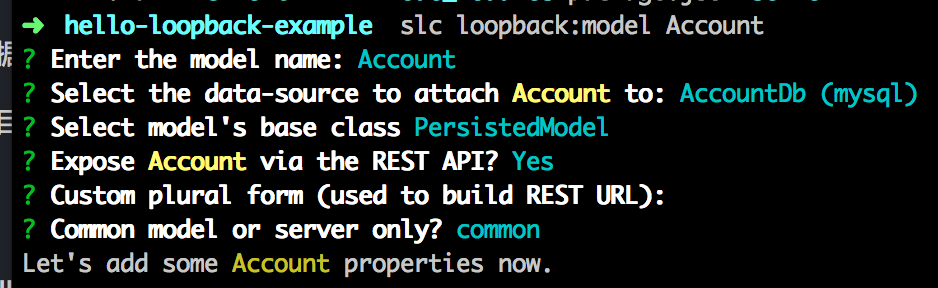

title: StrongLoop
---

## 关于StrongLoop

*StrongLoop* 是 *IBM*的一家子公司，`StrongLoop API Platform`构建于开源的[LoopBack.io](http://loopback.io/)之上，`LoopBack`是一个高度可扩展的Node.js API框架。借助于LoopBack，我们可以快速创建可扩展的API和数据库映射。

`StrongLoop`能与很多当前主流数据库集成使用，如`Mongodb`、`Mysql`等。

> 下面介绍的内容采用Mysql数据库作为示例，若使用其他数据库可对应修改

## 安装StrongLoop

在安装`StrongLoop`之前，请确保已经安装好：

- Node
- Xcode Commond Line Tools

在上面环境搭建好的情况下执行下面命令安装StrongLoop：

```bash
npm install -g strongloop
```

安装成功之后可以查看当前安装StrongLoop的版本：

```bash
slc -v
```

## 创建LoopBack应用程序

执行下面命令会在当前目录下面创建一个名为`loopback-demo`的应用程序：

```bash
slc loopback loopback-demo
```

紧接着输入程序名称和安装目录，完成程序的初始化。

## 运行LoopBack

在上面创建的LoopBack应用程序根目录下面执行下面命令启动应用程序：

```bash
slc run
```

在浏览器打开[http://127.0.0.1:3000/explorer/](http://127.0.0.1:3000/explorer/)，若能看到下面截图表示成功。


## 安装StrongLoop Mysql 连接器

在应用程序根目录下执行下面命令安装Mysql连接器，如想用其他数据库，只需要修改**mysql**关键词。

```bash
npm i --save loopback-connector-mysql
```

## 配置数据源

在上面已经添加了Mysql数据库支持，现在要为数据库配置数据源，下面命令创建名为“AccountDb”的新数据源：

```bash
slc loopback:datasource AccountDb
```

接受默认数据源名称，数据库类型这里选择Mysql。

在应用程序目录打开`server/datasources.json`文件，添加Mysql数据库的配置信息，示例如下：

```json
{
  "db": {
    "name": "db",
    "connector": "memory"
  },
  "AccountDb": {
    "host": "localhost",
    "port": 3306,
    "database": "strongloop_demo",
    "username": "root",
    "password": "",
    "name": "AccountDb",
    "connector": "mysql"
  }
}
```

## 创建数据模型

下面命令为`Account`对象创建一个模型

```bash
slc loopback:model Account
```

按照提示一步步选择，对于模型的"base class"，使用"PersistedModel"并选择通过`REST API`公开该模型。



对于数据模型上的属性，创建以下3个属性：


## 添加脚本来创建数据库中的模式

在项目根目录下的`server`文件夹创建一个`bin`目录，并且创建一个名为`automigrate.js`的文件，内容如下：

```javascript
var app = require('../server');

var accounts = [
  {
    email:'foo@bar.com',
    createdAt: new Date(),
    lastModifiedAt: new Date()
  },
  {
    email:'baz@qux.com',
    createdAt: new Date(),
    lastModifiedAt: new Date()
  }
];

// this loads the accountDb configuration in ~/server/datasources.json
var dataSource = app.dataSources.AccountDb;

// this automigrates the Account model 
dataSource.automigrate('Account', function(err) {
  if (err) throw err;

  // this loads the Account model from ~/common/models/Account.json
  var Account = app.models.Account;
  var count = accounts.length;
  accounts.forEach(function(account) {
  // insert new records into the Account table
  Account.create(account, function(err, record) {
    if (err) return console.log(err);

    console.log('Record created:', record);

    count--;

      if (count === 0) {
        console.log('done');
        dataSource.disconnect();
      }
    });
  });
});
```

## 创建Mysql模式

在项目根目录下执行下面命令行运行刚才创建的`autograte.js`脚本在Mysql创建一个表

```bash
node server/bin/automigrate.js
```

## 再次运行应用程序

再次执行下面命令就可以看到我们上面创建的表

```bash
slc run
```


## 使用资源管理器页面测试API

在[http://127.0.0.1:3000/explorer/](http://127.0.0.1:3000/explorer/)我们可以直接对API进行测试，单击”POST/Accounts“链接插入新数据。输入一条JSON记录并按下”Try it Out“即可看到插入的结果！

## 更多关于StrongLoop

详见[官方文档](http://docs.strongloop.com/)，打不开请自行翻墙！


